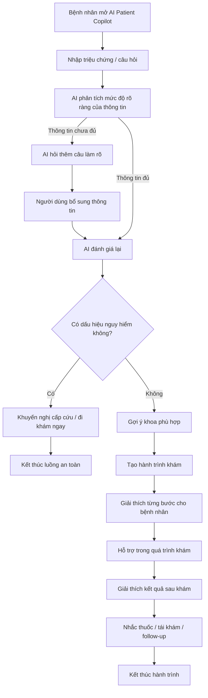
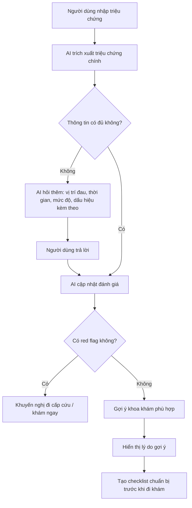
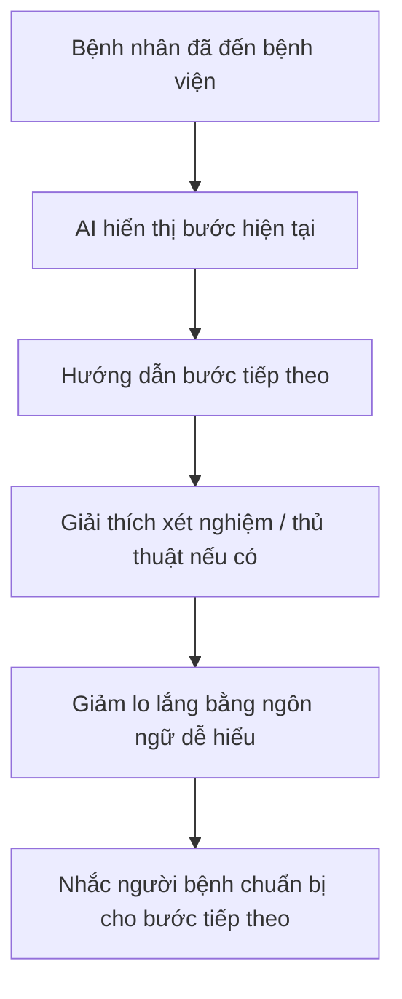
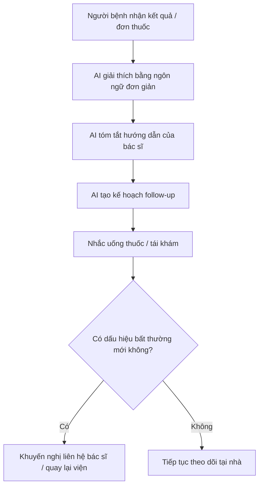
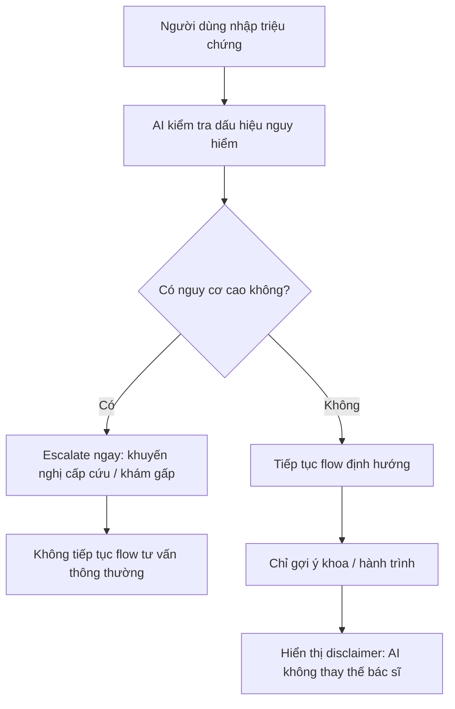
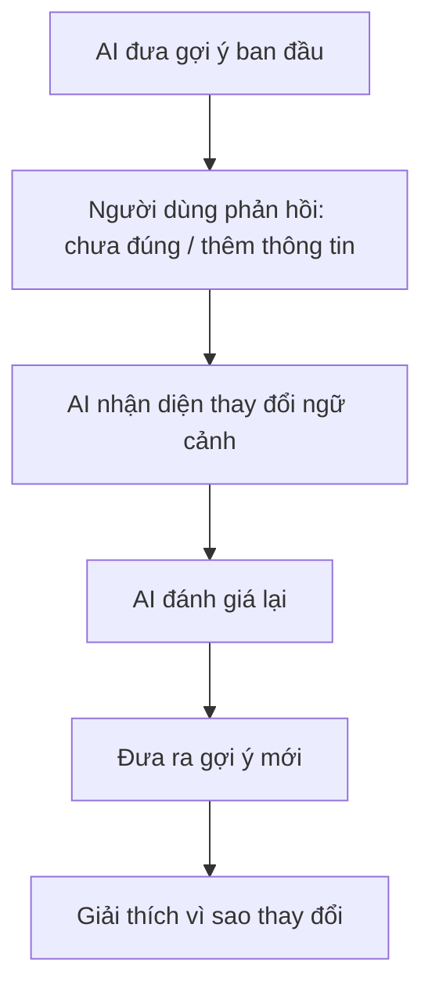
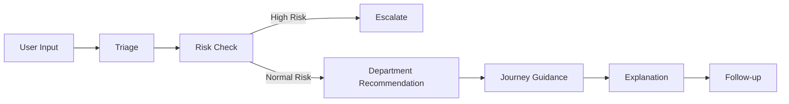

# Luồng Flow Chính — AI Patient Copilot cho Vinmec

Tài liệu này mô tả **luồng vận hành chính** của giải pháp **AI Patient Copilot cho Vinmec** dưới dạng dễ đọc và dễ nhúng vào SPEC / slide / GitHub.

---

# 1. Flow tổng thể end-to-end

---

# 2. Flow theo 3 giai đoạn chính

## 2.1. Giai đoạn trước khám

### Kết quả đầu ra kỳ vọng
- Khoa hoặc chuyên khoa đề xuất
- Mức độ ưu tiên
- Lý do gợi ý
- Checklist chuẩn bị trước khám

---

## 2.2. Giai đoạn trong khi khám

### Kết quả đầu ra kỳ vọng
- Người bệnh biết mình đang ở bước nào
- Hiểu bước tiếp theo
- Giảm lo lắng và giảm hỏi lặp lại

---

## 2.3. Giai đoạn sau khám

### Kết quả đầu ra kỳ vọng
- Người bệnh hiểu kết quả và đơn thuốc
- Tăng tuân thủ điều trị
- Không tự ý bỏ tái khám

---

# 3. Luồng safety ưu tiên cao

Đây là flow cực kỳ quan trọng để tránh việc AI hành xử như một hệ thống chẩn đoán.

### Red flags phải nhận diện
- Đau ngực dữ dội
- Khó thở
- Vã mồ hôi
- Sốt cao ở trẻ nhỏ
- Chóng mặt nặng / ngất / dấu hiệu nguy cấp khác

---

# 4. Luồng correction path

Flow này giúp hệ thống không bị “cứng”, mà có thể sửa hướng khi user bổ sung thông tin mới.

### Ý nghĩa
- Tăng độ tin cậy
- Giảm lỗi do input ban đầu thiếu
- Thể hiện AI biết điều chỉnh thay vì cố bảo vệ câu trả lời cũ

---

# 5. Luồng logic sản phẩm ở mức ngắn gọn

---

# 6. Bản text flow đơn giản để đưa vào slide

## Flow chính
1. Người bệnh nhập triệu chứng hoặc câu hỏi  
2. AI hỏi thêm nếu thông tin chưa đủ  
3. AI kiểm tra dấu hiệu nguy hiểm  
4. Nếu nguy hiểm → khuyến nghị cấp cứu / khám ngay  
5. Nếu không nguy hiểm → gợi ý khoa phù hợp  
6. AI tạo hành trình khám từng bước  
7. AI giải thích xét nghiệm / kết quả bằng ngôn ngữ đơn giản  
8. AI nhắc thuốc, tái khám và follow-up sau khám  

---

# 7. Câu mô tả flow ngắn để pitch

> AI Patient Copilot guides patients from symptom intake to recovery follow-up, while always prioritizing safety escalation over diagnosis.

---

# 8. Gợi ý cách dùng trong bài thi

Bạn có thể dùng flow này ở 3 nơi:
- Trang mô tả solution overview
- Trang demo architecture / user journey
- Trang safety and guardrails

Nếu chỉ chọn 1 flow để đưa lên slide, nên dùng:
- **Flow tổng thể end-to-end**
- hoặc **Flow safety ưu tiên cao**